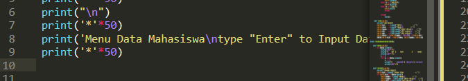
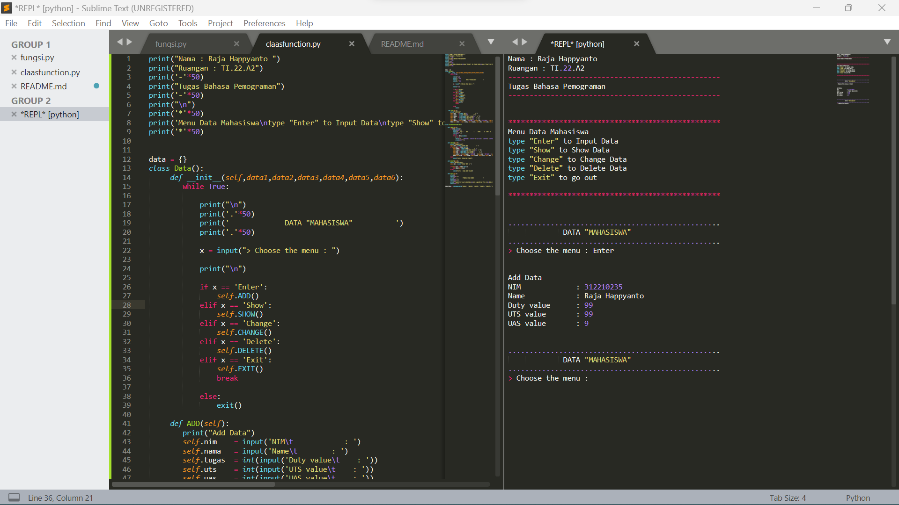
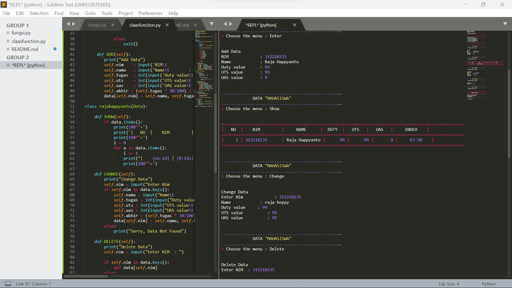
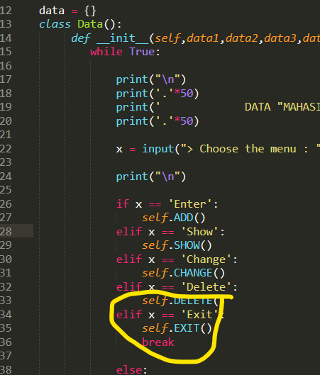

```
nama : raja Heppyanto
Nim  : 312210235
TI.22.A2
```

## PRAKTIKUM 8 (PERTEMUAN12)

### PROGRAM SEDERHANA MENGGUNAKAN CLASS

##### step by step
1. Gunakan perintrak print di paling atas untuk pemberitahuan informasi menu yang terdapat di program


 ```
gambar output + potongan code
 ```


 

2. Deklarasi data{} untuk class data
3. def init dan statement if untuk perintah di masing masing def
4. Def add(self) untuk perintah tambah data dan isi nya
 ```
gambar output + potongan code
 ```
 
 

5. gunakan class rajahappyanto(boleh nama lain) untuk/supaya isi dari def add ter aplikasikan/terhubung ke fungsi lainnya(def show, def change, def delete, def exit)
6. gunakan def  show untuk menampilkan isi dari def add
7. gunakan def change untuk mengubah data di def add dengan catatan"masukkan statetment if untuk perintah add NIM, jika Nim tidak terdeteksi maka print("sorry, Data not found")
 ```
gambar output + potongan code
 ```

 

8. Def Delete untuk menghapus data
9. Def exit untuk keluar dari perintah
 ```
gambar output + potongan code
 ```
 


10. NOTE " gunakan perintah break pada elif exit di bagian def init untuk menghentikan perulangan setelah perintah exit"
 ```
gambar output + potongan code
 ```



 ### FLOWCHART
  ```
gambar 
 ```


## Sekian dari Saya "Terima kasih"
